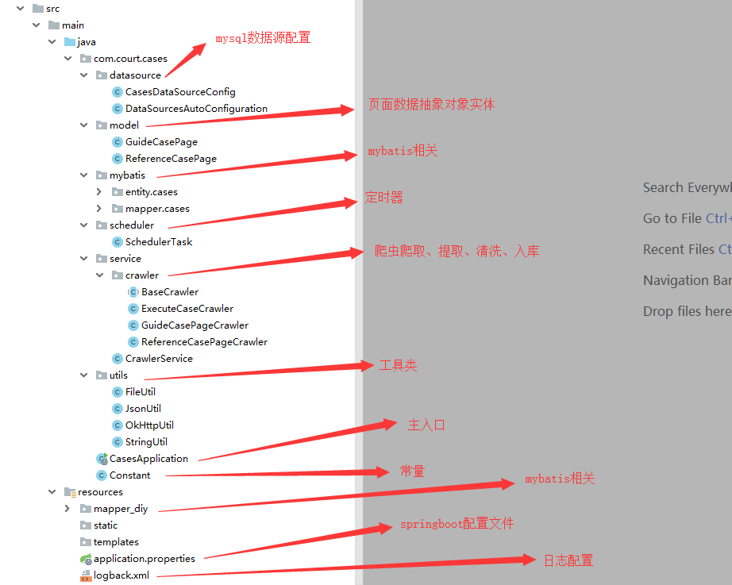
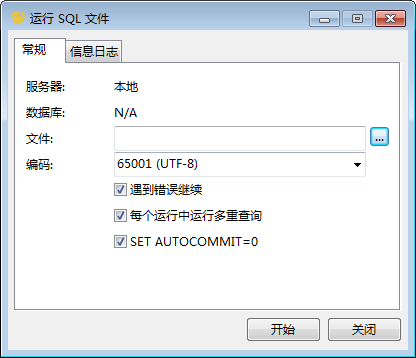
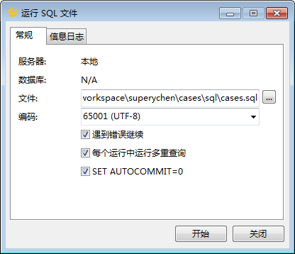
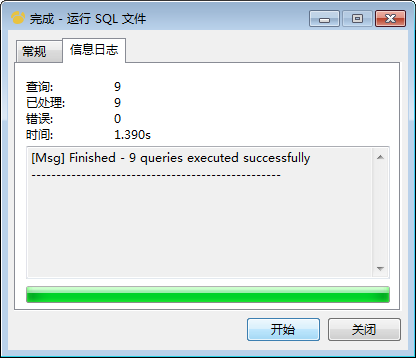

# 简介

### 代码简介


### 主要技术
- SSM
- mysql
- [Mybatis通用Mapper](https://gitee.com/free/Mapper)
- [okhttp](https://square.github.io/okhttp/)
- [jsoup](https://jsoup.org/)

### 整体逻辑
1. 使用爬虫爬取[中国审判流程信息公开网](https://splcgk.court.gov.cn/gzfwww//qwal)指导性案例与参考性案例列表与详情数据
2. 使用爬虫爬取[中国执行信息公开网](http://zxgk.court.gov.cn/)执行案例列表与详情数据
3. 对爬取到的数据进行提取，清洗，处理后入库
4. 对网站数据与数据库中数据根据时间与唯一标示进行比对，对已经在库中存在的数据不再进行抓取，仅抓取新增内容
5. 在项目启动时，执行1-4逻辑
6. 使用cron表达式，定时执行1-4逻辑

### 部署流程
1. 安装intellij idea
2. 安装mysql数据库
3. 安装navicat数据库操作软件
4. 使用navicat连接本地数据库

5. 右键本地数据库，选择运行sql文件

6. 选中项目根目录下```sql/cases.sql```文件

7. 点击开始，执行sql脚本，完成后刷新数据库即可看见生成的数据库与表
